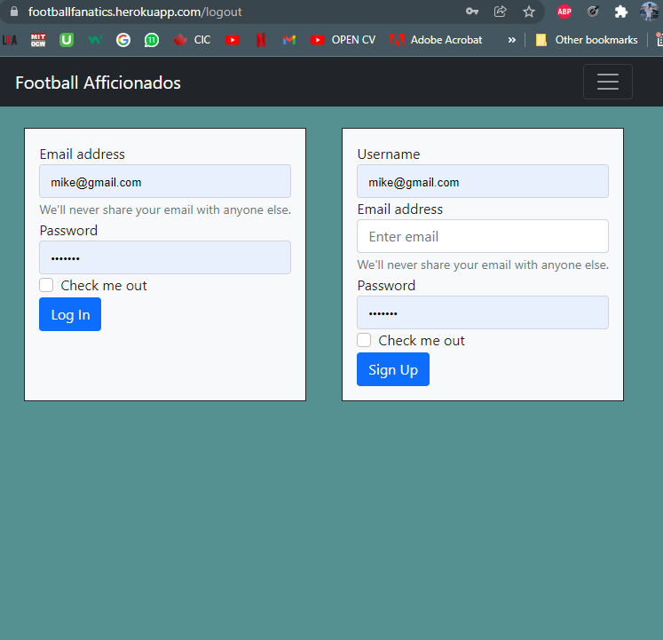
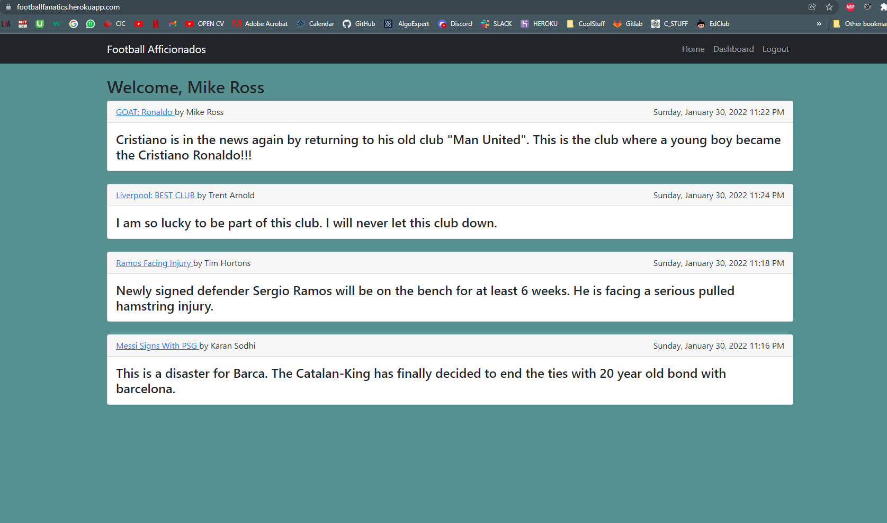
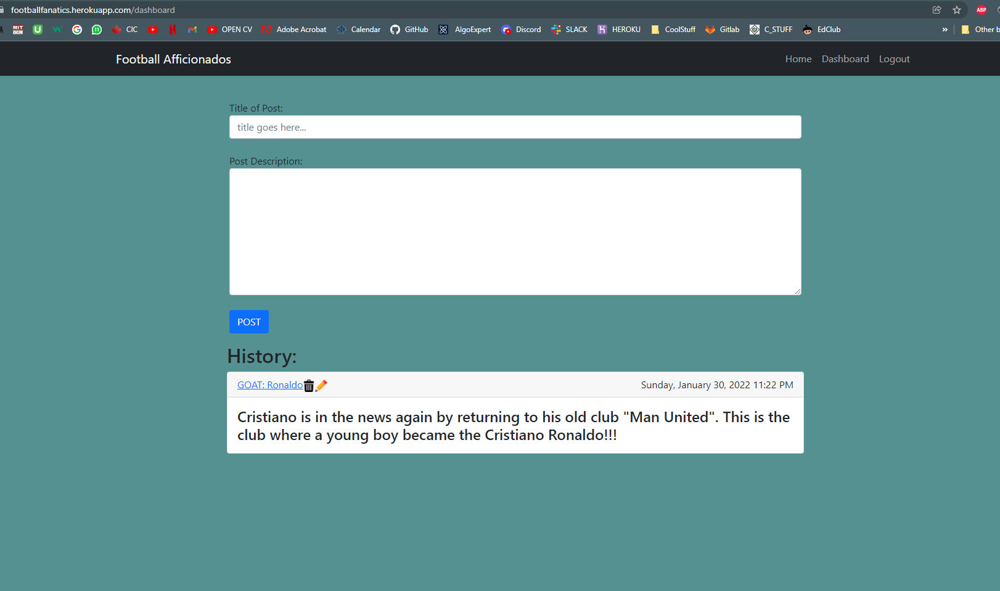

<h1 align='center'>Football Fanatics Blog</h1>
    
    <h2 id="description">Description</h2>
    
In this project, a user lands on a page with multiple posts. He can view the titles but cannot see the comments or leave a comment on it. In order to do that, he needs to sign up with a new account and then he is automatically redirected to the homepage where he can click on a post and leave a comment or check old comments. He can also create a new post by clicking on the dashboard link in the navigation. He will need to add the title and description and when he posts it, he will be redirected to the homepage with his latest post visible right at the top. Plus, in the dashboard view, he can see all his previous posts which he can either delete or edit. If he chooses to edit a post, he will be redirected to the editPost page where he can edit the title or description and on update button click, his post will be modified and will be displayed at the top of the feed. In the homepage, the posts are displayed from most recent to oldest. The app is also incorporated with session expiration of 10 minutes. The user will be logged out automatically after 10 minutes of inactivity.

    Link : https://footballfanatics.herokuapp.com/
    

    <h2>Table of Contents</h2>
    <ul>
        <li><a href="#description">Description</a></li>
        <li><a href="#install">Installation</a></li>
        <li><a href="#usage">Usage</a></li>
        <li><a href="#license">License</a></li>
        <li><a href="#contri">Contributing</a></li>
        <li><a href="#test">Tests</a></li>
        <li><a href="#question">Questions</a></li>
    </ul>
    

    <h2 id="install">Installation</h2>
    
bcrypt, sequelize, express-handlebars, express-session, connect-session-sequelize

    

    <h2 id="usage">Usage</h2>
    
UofT Bootcamp

    

    <h2 id="license">License</h2>
    
    
MIT

    

    <h2 id="contri">Contributing</h2>
    
Karan Sodhi

    

    <h2 id="test">Tests</h2>
    
Unit

    

    <h2 id="question">Questions</h2>
    
Incase of questions, Find me on: 

    
 :<a href='mailto: karanpreetsodhi1997@gmail.com'>Email</a>

    
 :<a href='https://github.com/kkkaran'>Github</a>

    

